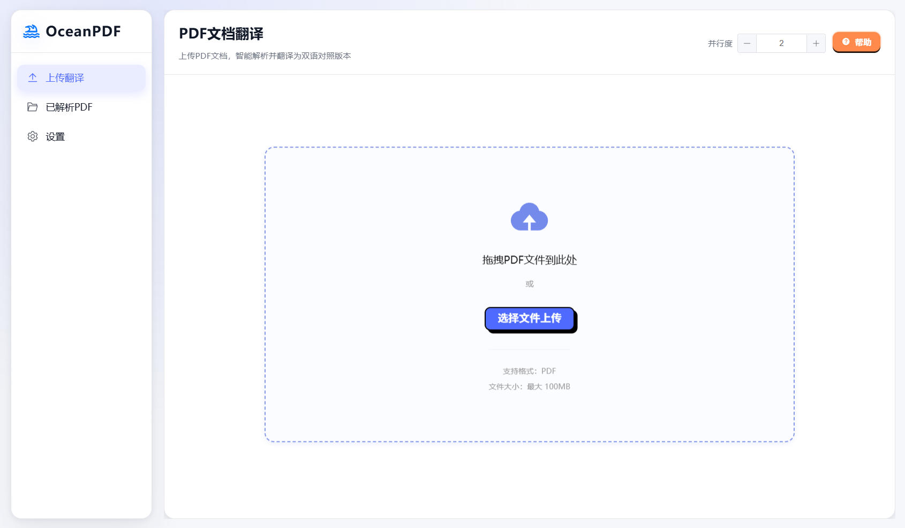
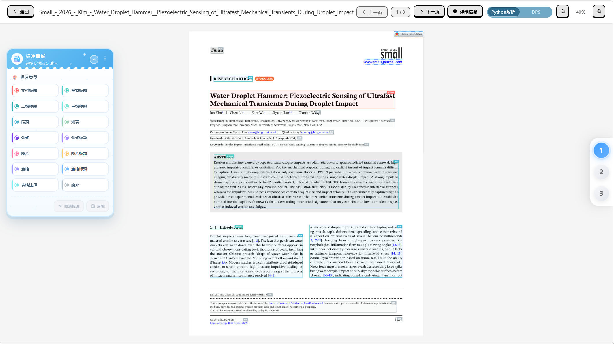
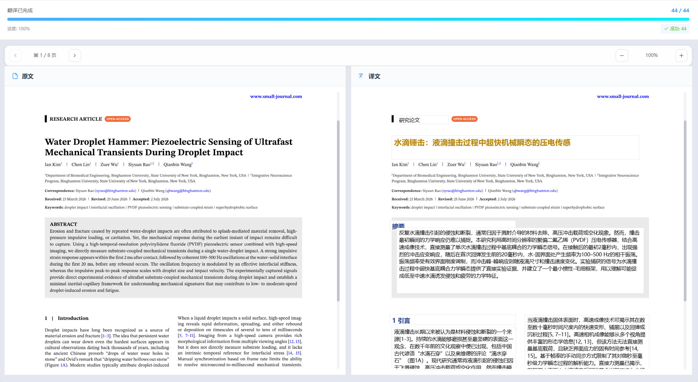

<div align="center">

#  OceanPDF 2.0

**桌面端 PDF 论文智能翻译与双语对照排版工具**

[](LICENSE)
[](https://www.python.org/)
[](https://vuejs.org/)
[](https://fastapi.tiangolo.com/)

**智能解析 · AI翻译 · 双语排版 · 桌面应用**

</div>

---

## ✨ 界面预览

<div align="center">

### 📄 主界面 — 拖拽上传，一键翻译



### 🏷️ 标注界面 — 智能版面分析，精准元素标注



###  双语对照翻译界面 — 原文译文并排，实时进度追踪



</div>

---

##  核心功能

| 功能模块 | 描述 |
|:---:|:---|
| 📄 **智能PDF解析** | 基于 PP-DocLayoutV2 的版面分析 + PaddleOCR 文字识别 |
| 🤖 **AI智能翻译** | 支持 DeepSeek / OpenAI / Claude 等多种大模型 API |
|  **双语对照排版** | 原文译文逐元素对齐，保持学术文档格式 |
| 🏷️ **可视化标注** | 12种标注类型，支持框选、合并、阅读顺序管理 |
| 💻 **桌面端应用** | 基于 Electron 的跨平台桌面应用 |
| 📊 **任务管理** | SSE 实时进度推送，支持暂停/继续/停止 |

---

## 🏗️ 技术架构

```
  ┌─────────────────────────────────────────┐
  │         Electron Desktop App            │
  │                                         │
  │  ┌──────────┐ ┌──────────┐ ┌─────────┐ │
  │  │ Vue 3    │ │ Pinia    │ │ Axios   │ │
  │  │ + Vite   │ │ State    │ │ HTTP    │ │
  │  └────┬─────┘ └──────────┘ └────┬────┘ │
  └───────┬─────────────────────────────────┬──────┘
          │ HTTP/REST                │ HTTP/REST
          ▼                          ▼
  ┌─────────────────────────────────────────┐
  │         FastAPI Backend (:8000)         │
  │                                         │
  │  ┌──────────┐ ┌──────────┐ ┌─────────┐ │
  │  │ PDF      │ │ Annot.   │ │ Trans.  │ │
  │  │ Parser   │ │ Service  │ │ Engine  │ │
  │  │(PyMuPDF) │ │          │ │ (SSE)   │ │
  │  └──────────┘ └──────────┘ └─────────┘ │
  └──────────────────┬──────────────────────┘
                     │ HTTP
                     ▼
  ┌─────────────────────────────────────────┐
  │          DPS Service (:8001)            │
  │                                         │
  │  ┌──────────────────┐ ┌──────────────┐ │
  │  │ PP-DocLayoutV2   │ │ PaddleOCR    │ │
  │  │ Layout Analysis  │ │ Text Recogn. │ │
  │  └──────────────────┘ └──────────────┘ │
  └─────────────────────────────────────────┘
```

### 技术栈

- **前端**: Electron + Vue 3 + Vite + Element Plus + Pinia
- **后端**: FastAPI + Pydantic + asyncio
- **文档解析**: PyMuPDF + PP-DocLayoutV2 + PaddleOCR
- **AI翻译**: DeepSeek / OpenAI / Claude API
- **PDF生成**: PyMuPDF + ReportLab

---

## 📦 快速开始

### 环境要求

- **Python**: 3.12（推荐）
- **Node.js**: 18.0+
- **npm**: 9.0+

### 1️⃣ 启动 DPS 文档解析服务

```powershell
cd DPS
py -3.12 -m venv venv
.\venv\Scripts\activate
pip install paddlepaddle -i https://pypi.tuna.tsinghua.edu.cn/simple
pip install -r requirements.txt -i https://pypi.tuna.tsinghua.edu.cn/simple
.\venv\Scripts\python .\pp_doclayoutv2_api_new.py --host 127.0.0.1 --port 8001
```

>  首次启动会自动下载模型（约几百MB），请确保网络畅通。GPU 加速请参考 `DPS/INSTALL.md`。

### 2️⃣ 启动后端服务

```powershell
cd backend
py -3.12 -m venv .venv
.\.venv\Scripts\activate
pip install -r requirements.txt -i https://pypi.tuna.tsinghua.edu.cn/simple
uvicorn app.main:app --reload --port 8000
```

### 3️⃣ 启动前端

```bash
cd frontend
npm install --registry=https://registry.npmmirror.com/
npm run dev
```

前端运行在 `http://localhost:5173`，后端 API 文档 `http://127.0.0.1:8000/docs`。

---

## 📡 服务端口

| 服务 | 端口 | 说明 |
|:---:|:---:|:---|
| 前端应用 | 5173 | Vue 开发服务器 |
| 后端 API | 8000 | FastAPI 主服务 |
| DPS 解析 | 8001 | 版面分析 + OCR |

---

## 📁 项目结构

```
OceanPDF2.0/
├── frontend/              # Electron + Vue 前端
│   └── src/renderer/      #   渲染进程（UI组件、视图、API封装）
├── backend/               # FastAPI 主后端
│   ├── app/api/           #   RESTful API 路由
│   ├── app/services/      #   业务逻辑（解析、标注、翻译）
│   ── storage/           #   文件存储（上传、解析结果、导出）
├── DPS/                   # 文档解析微服务
│   ├── core/              #   配置、日志、模型加载器
│   └── services/          #   版面分析、OCR 服务
└── picture/               # 界面截图
```

---

## 📄 许可证

MIT License

---

<div align="center">

**OceanPDF 2.0** — 让学术翻译更高效 🌊

</div>
